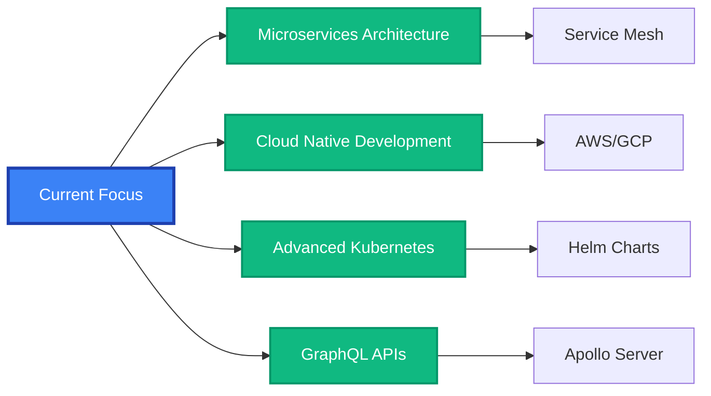

<div align="center">

# 👋 ¡Hola! Soy Omar Salvatierra


[](https://omar-xyz.shop)
[](https://www.linkedin.com/in/omarsalvatierra)
[](mailto:omargabrielsalvatierragarcia@gmail.com)


</div>

---

## 🎯 Sobre Mí

Soy un **desarrollador backend especializado en Python** con experiencia en la creación de sistemas escalables, APIs robustas y soluciones de automatización. Me apasiona construir infraestructura confiable que resuelva problemas reales del mundo empresarial.

```python
class OmarSalvatierra:
    def __init__(self):
        self.role = "Python Backend Developer"
        self.location = "México 🇲🇽"
        self.languages = ["Spanish (Native)", "English (Advanced)", "French (Intermediate)"]
        self.current_focus = "Building scalable backend systems & automation"

    def get_skills(self):
        return {
            "backend": ["Python", "Flask", "FastAPI", "Django"],
            "databases": ["PostgreSQL", "MySQL", "SQLite", "Redis"],
            "infrastructure": ["Docker", "Kubernetes", "Nginx", "Linux"],
            "automation": ["Selenium", "AsyncIO", "Celery", "Pandas"],
            "tools": ["Git", "GitHub Actions", "CI/CD", "REST APIs"],
            "data": ["XML/JSON Parsing", "OpenPyXL", "Data Processing"]
        }

    def get_current_work(self):
        return "Python Developer @ OFS - Audit & Fiscal Oversight"
```

---

## 🛠️ Stack Tecnológico

<div align="center">

### 💻 Lenguajes & Frameworks


### 🗄️ Bases de Datos


### ☁️ DevOps & Infraestructura


### 🔧 Herramientas & Tecnologías


</div>

---

## 📊 Estadísticas de GitHub

<div align="center">


</div>

<div align="center">


</div>

<div align="center">


</div>

---

## 🏆 Logros de GitHub

<div align="center">

[](https://github.com/ryo-ma/github-profile-trophy)

</div>

---

## 🚀 Proyectos Destacados

<div align="center">

<table>
<tr>
<td width="50%">

### 🔐 ValidaSAT
**Validador Masivo de XML para CFDI**

Sistema robusto de validación de comprobantes fiscales digitales utilizando la API del SAT de México.

**🛠️ Tech Stack:**
- Python, Flask, lxml
- XML Processing
- REST API Integration
- Async Processing

**✨ Características:**
- ✅ Validación masiva de XML
- ✅ Integración con API SAT
- ✅ Procesamiento asíncrono
- ✅ Reportes detallados

</td>
<td width="50%">

### 🔍 Sistema de Automatización de Auditorías
**Pipeline Automatizado para Auditorías Fiscales**

Solución completa para automatizar procesos de auditoría de cuentas públicas.

**🛠️ Tech Stack:**
- Python, Selenium
- AsyncIO, Pandas
- Data Processing
- Web Scraping

**✨ Características:**
- ✅ Automatización de workflows
- ✅ Extracción de datos
- ✅ Procesamiento paralelo
- ✅ Generación de informes

</td>
</tr>
</table>

<br/>

[](https://github.com/OmarSalvatierra99)

📌 **[Ver todos mis proyectos →](https://omar-xyz.shop)**

</div>

---

## 💼 Experiencia Profesional

<details open>
<summary><b>🔹 Python Developer @ OFS (Audit & Fiscal Oversight)</b></summary>
<br/>

📅 **Septiembre 2024 – Presente**

- 🔧 Desarrollo de pipelines de automatización en Python para procesos fiscales y de auditoría
- 🚀 Implementación de sistemas de validación de datos y reportería automatizada
- 📊 Optimización de procesos de análisis de información fiscal
- 🔐 Integración con APIs gubernamentales (SAT, INEGI)

**Tecnologías:** Python, FastAPI, Selenium, Pandas, PostgreSQL, Docker

</details>

<details>
<summary><b>🔹 Backend Developer @ Tornillera Central S.A. de C.V.</b></summary>
<br/>

📅 **Abril 2023 – Septiembre 2024**

- 🛒 Construcción de sistemas de inventario y ventas con Django y React
- 🔄 Desarrollo de APIs REST para integración de sistemas
- 📦 Gestión de bases de datos relacionales y optimización de queries
- 🚀 Implementación de CI/CD con GitHub Actions

**Tecnologías:** Django, React, PostgreSQL, Redis, Docker, Nginx

</details>

<details>
<summary><b>🔹 Python Developer @ Comercializadora Plugar S.A. de C.V.</b></summary>
<br/>

📅 **Enero 2018 – Mayo 2022**

- 🤖 Creación de herramientas de automatización para integración ERP
- 📊 Desarrollo de sistemas de procesamiento de datos empresariales
- 🔗 Integración de APIs con sistemas legacy
- 📈 Análisis y visualización de datos de negocio

**Tecnologías:** Python, Flask, MySQL, Pandas, OpenPyXL, Selenium

</details>

---

## 🎓 Educación & Certificaciones

<div align="center">

| 🎓 Grado | 🏫 Institución | 📅 Año |
|---------|---------------|--------|
| **Maestría en Auditoría Gubernamental** | Universidad del Estado de México | 2024 - En curso |
| **Licenciatura en Gestión Empresarial** | Instituto Tecnológico Superior de Irapuato | 2013 - 2017 |

</div>

### 📜 Certificaciones

```
🏅 Python for Data Science         │ IBM
🏅 Docker & Kubernetes              │ Linux Foundation
🏅 REST API Development             │ Postman
🏅 Linux System Administration      │ Linux Academy
🏅 GitHub Actions CI/CD             │ GitHub Learning Lab
```

---

## 📈 Actividad de Desarrollo

<div align="center">

<!--START_SECTION:waka-->
<!--END_SECTION:waka-->

</div>

---

## 🌱 Actualmente Aprendiendo

<div align="center">



</div>

---

## 🤝 Colaboremos Juntos

<div align="center">

### 💡 Estoy interesado en colaborar en:

🔹 **Proyectos Open Source** en Python
🔹 **Sistemas de automatización** empresarial
🔹 **APIs REST/GraphQL** escalables
🔹 **Soluciones de procesamiento de datos**
🔹 **Herramientas DevOps** y CI/CD

### 📫 ¿Cómo contactarme?

<a href="https://omar-xyz.shop" target="_blank">
  
</a>
<a href="https://www.linkedin.com/in/omarsalvatierra" target="_blank">
  
</a>
<a href="mailto:omargabrielsalvatierragarcia@gmail.com">
  
</a>
<a href="https://github.com/OmarSalvatierra99">
  
</a>

</div>

---

## 📚 Blog & Artículos

<div align="center">

🔍 Comparto conocimiento sobre Python, Backend Development y DevOps

📝 [Visita mi blog →](https://omar-xyz.shop/blog)

</div>

---

## 💬 Una Frase que Me Define

<div align="center">

```ascii
╔══════════════════════════════════════════════════════════════════════╗
║                                                                      ║
║  "Construyo sistemas Python confiables que automatizan,             ║
║   escalan y perduran. La calidad del código es mi prioridad."       ║
║                                                                      ║
║                                              — Omar Salvatierra      ║
║                                                                      ║
╚══════════════════════════════════════════════════════════════════════╝
```

</div>

---

## 📊 Métricas del Perfil

<div align="center">


</div>

---

<div align="center">

### 🌟 Si te gusta mi trabajo, ¡considera darle una ⭐ a mis repositorios!


---

**© 2025 Omar Salvatierra | Construido con ❤️ y Python**

</div>
